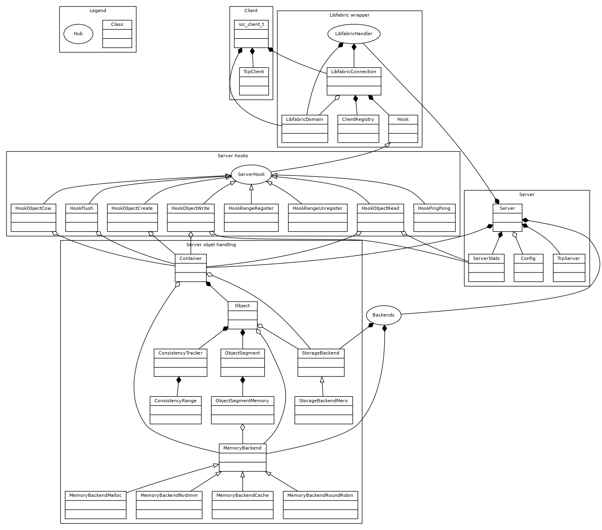

Source code exploration
=======================

This page will shortly describes how to navidate over the source code and provides
the object UML diagram to better understand how the project is structured.

Directory structure
-------------------

The root directory is splitted in :

* extern-deps: This directory contain source code imported from external
  open source projects. Mainly it contains the GoogleTest.
* src: It contains all the sources of the project.
* examples: Some example to better understand the usage of iocatcher.

In the src directory you will find:

* base: this directory contain the common code between the client and server. It
  provide the basic debugging infrastructure and the network base code wrapping
  libfabric to ease the rest of the implementation.
* server: provide all the code used to implement the iocatcher server. This means
  the network hooks and the container/object handling code.
* client: provide the implementation of the client API. Even if it is currently
  implemented in C++ the client API is exposed to the user with a C interface.

UML class diagram
-----------------

Walking over the class diagram concepts
---------------------------------------

In this section, we will walk over the UML class diagram to better understand
the core conecpts of the iocatcher source code.

Networking
----------

For the network iocatcher rely on the `libfabric <https://ofiwg.github.io/libfabric/>`_
library providing a common wrapper on most HPC high speed networks like Infiniband.
It avoid directly using the verbs API which is harder to handle. It also kindly
provde a TCP fallback which help for local developpement and portability.

In order to ease the client/server code implementation iocatcher provide a small
abstraction layer on top of libfabric so the rest of the code is agnostic to it.
This is shown in the UML diagram in the **libfabric wrapper** box. It provides:

* A fabric domain abstraction (LibfabricDomain) which is mostly used to build 
  the connections and handle the memory registration for RDMA operations.
* A connection wrapper (LibfabricConnection) to handle all the network 
  operations we require in the project (rdma read/write, message, polling...).
* A client registry to track the active client connected to the server.

One remark here, libfabric provide mostly two connection handling mode which
are MSG and RDM. In our implementation we currently exploit the RDM mode so 
we might easilty support out internal BXI product when the libfabric support 
will be done. On an Infiniband system this comes with an extra layer provided by 
libfabric which is the RXM provider building an RDM provider on top of the MSG
one impolemented to support the Infiniband verbs API.

Network hooks
-------------

The network provide a last abstraction through the **Hook** class which is used
to tell how to implement the actions to place behind a protocol request.
When reciving a message we will use the message type field from the message header
to know which hook to call if available and return an error if not found.

The **Server hooks** box list all the hook implemented on the server side, each
one corresponding to a type of action request from the client.

About the TCP classes
---------------------

If you look on the UML diragram you will find two classes related to the TCP
protocol. They come to fix a limitation of the RDM protocol from libfabric.
When using this protocol libfabric does not provide any notification when a
client disconnect. In our iocatcher protocol we wanted to explorer the tracking
of the active memory mapping made by ummap-io so we need this notification.

As a proof of concept we added the disconnection tracking by spawning a TCP 
connection between the client and the server so we be notified when it drop.
This can be a scalability limitation when considering a large number of clients
so we made such it is optional and can easily be disabled if needed to scale
and if we accept to loose the mapping tracking.

Server
------

The main entry point of the server is handled by the **Server** class which
aggregate the connection and the container/object handling.

Object handling
---------------

The object handling is structured under three concepts:

* The container track all the objects known by iocatcher. There is a uniq
  container in the server.
* Each object is represented by an instance of the Object class.
* Each object is composed of segments which represent the data stored in the
  server.

Backends
--------

The iocatcher server can exploir two categories of backeds:

* A StorageBackend defining to who to send the data on a sync operations and
  from who to load data on first read access. This backend can be disabled by
  using a NULL pointer and we currently provide only a MeroBackend to access
  Mero objects.
* A MemoryBackend permitting to say how to allocate and handle the memory used 
  to store the object segments. The goal is to be able to use standard memory or
  switch to NVDIMM memory. You will also notice caches implements which are used
  to efficiently exploit the NVDIMM. When using NVDIMM storage we create files
  with a growing size and want to handle smaller allocations in this file, this
  is what is provided by those classes.

Consistency ranges
------------------

Those elements are attached to each object and be used to track the active client
mappings so we can forbid having to write mapping on the same range on the same
object. This is the reason of the TCP class. When a client disconnect we need to
automatically unregister all the mappings owned by this client so it been 
available again to other clients.

Segment versus memory segments
------------------------------

The class diagram distinguish the **ObjectSegment** from the 
**ObjectSegmentMemory**. This is done to be handle the copy on write
mechanism so many segments can point to the same memory segment and can trigger
a copy on first write access.

Client
------

The client is simply composed of a TCP client which just establish a TCP
connection with the server and a client struct which group this TCP connection
with a libfabric one.

In the code, all the client actions are implemented in the flat file Action.cpp.

